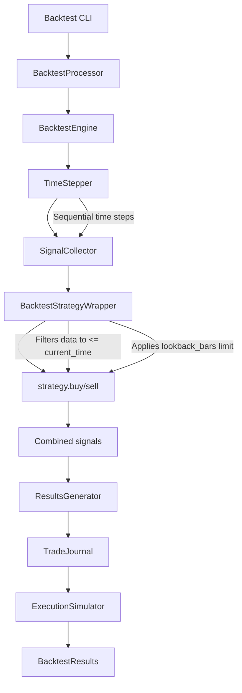

# Trading Strategy Framework

## Overview

A trading strategy is a function that takes an OHLCV data window for a ticker and produces timestamped `buy` and `sell` signals. Strategies are executed sequentially at each time step during backtesting or forward testing, with each step seeing only historical data up to that point.

## Inputs and Outputs

### Inputs

- **`ohlcv_data`**: DataFrame indexed by datetime with required columns: `open`, `high`, `low`, `close`, `volume`
- **`ticker`**: Stock ticker symbol (string)
- **`lookback_bars`** (optional): Maximum number of historical bars to use per time step. If `None`, uses all available history up to the current time step.

### Outputs

Strategies implement two methods that return DataFrames:

- **`buy(ohlcv_data, ticker)`**: Returns DataFrame with buy signals
- **`sell(ohlcv_data, ticker)`**: Returns DataFrame with sell signals

Each DataFrame must have:
- **Index**: Timestamp (datetime)
- **Required columns**: `price` (float)
- **Optional columns**: `metadata` (JSON string)

The backtest engine automatically:
- Combines buy and sell signals from your strategy's `buy()` and `sell()` methods
- Adds `signal_type` column ("buy" or "sell")
- Adds `side` column ("LONG" or "SHORT" based on your strategy's `side` attribute)
- Adds `ticker` and `signal_time` columns
- Processes signals through the trade journal and execution simulator

## Execution Workflow

The backtest engine executes strategies sequentially through time:



### Key Points

1. **Sequential Execution**: `TimeStepper` generates a sequence of timestamps. The engine steps through each one sequentially.
2. **No Forward-Looking**: `BacktestStrategyWrapper` ensures strategies only see data with `index <= current_time`.
3. **Lookback Window**: If `lookback_bars` is set, the data is further truncated to the last N rows before being passed to the strategy.
4. **Signal Collection**: Signals are collected at each step and filtered to prevent duplicates.

## Strategy Types: LONG vs SHORT

Strategies declare their type via `strategy_type`:

- **`strategy_type = "LONG"`**: 
  - `buy()` = open/increase long exposure
  - `sell()` = close/reduce long exposure
- **`strategy_type = "SHORT"`**:
  - `buy()` = open/increase short exposure  
  - `sell()` = close/reduce short exposure

The base orchestration is identical for both types; the execution layer interprets `side` appropriately.

## Writing Your Own Strategy

### Step 1: Subclass Strategy

```python
from system.algo_trader.strategy.strategy import Side, Strategy
import pandas as pd

class MyStrategy(Strategy):
    def __init__(self, my_param: int, side: Side = Side.LONG, window: int | None = None, **kwargs):
        # Validate parameters
        if my_param < 1:
            raise ValueError("my_param must be >= 1")
        
        # Initialize base class with side and optional window
        super().__init__(side=side, window=window, **kwargs)
        
        self.my_param = my_param
        # Initialize any studies you need
        # self.my_study = SomeStudy()
```

### Step 2: Implement buy() and sell()

```python
def buy(self, ohlcv_data: pd.DataFrame, ticker: str) -> pd.DataFrame:
    # Use studies to compute indicators
    # indicator = self.my_study.compute(ohlcv_data=ohlcv_data, ticker=ticker, ...)
    # if indicator is None:
    #     return pd.DataFrame()  # Insufficient data
    
    # Detect buy conditions
    buy_signals = []
    for idx in ohlcv_data.index:
        # Your buy logic here
        if some_condition:
            buy_signals.append({
                "timestamp": idx,
                "price": ohlcv_data.loc[idx, "close"],
                "metadata": json.dumps({"some_key": some_value})
            })
    
    if not buy_signals:
        return pd.DataFrame()
    
    signals_df = pd.DataFrame(buy_signals)
    signals_df = signals_df.set_index("timestamp")
    return signals_df

def sell(self, ohlcv_data: pd.DataFrame, ticker: str) -> pd.DataFrame:
    # Similar pattern for sell signals
    ...
```

### Step 3: Implement add_arguments() class method

```python
@classmethod
def add_arguments(cls, parser):
    Strategy.add_arguments(parser)  # Adds --side and --window
    parser.add_argument(
        "--my-param",
        type=int,
        default=10,
        help="My parameter description (default: 10)",
    )
```

### Example: SMACrossover

See `system/algo_trader/strategy/strategies/sma_crossover.py` for a complete working example:

- Uses `SimpleMovingAverage` study
- Accepts `side`, `window`, `short`, and `long` parameters
- Detects crossovers in `buy()` and `sell()`
- Returns signals with `price` column

## Available Studies

The `studies` layer provides reusable technical indicators:

- **Moving Averages**: `SimpleMovingAverage` (see `strategy/studies/moving_average/`)
- **Support/Resistance**: `FindValleys`, `FindPeaks` (see `strategy/studies/support_resistance/`)

All studies inherit from `BaseStudy` and provide a `compute()` method that handles validation and returns Series or DataFrames.

## Lookback Window

Strategies can accept an optional `window` parameter that specifies the maximum number of historical bars to use. The backtest engine automatically filters OHLCV data to respect this window size before passing it to your strategy's `buy()` and `sell()` methods.

Example:
- `SMACrossover` with `long=20` typically needs at least 20 bars
- If `window=10` is set, the strategy will only receive the last 10 bars of data
- Your strategy should handle cases where insufficient data is available (return empty DataFrame)

The backtest engine ensures strategies never see future data, maintaining proper temporal isolation.

