# Algo Trader System Architecture Flowchart

This document contains the complete Mermaid flowchart showing the data flow and architecture of the algo_trader system, including proper configuration connections.

## System Overview

The algo_trader system is designed to support both standalone (localhost) and microservice (Docker/containerized) deployments through a configuration management layer that enables service coordination via Redis as the data boundary layer.

## Architecture Flowchart

```mermaid
graph TB
    %% External Data Sources
    SCHWAB[Schwab API<br/>Market Data Source]
    
    %% Configuration Layer
    CONFIG[AlgoTraderConfig<br/>System Configuration]
    SCHWAB_CONFIG[SchwabConfig<br/>API Credentials]
    REDIS_CONFIG[RedisConfig<br/>Cache Settings]
    INFLUX_CONFIG[InfluxDBConfig<br/>Database Settings]
    
    CONFIG --> SCHWAB_CONFIG
    CONFIG --> REDIS_CONFIG
    CONFIG --> INFLUX_CONFIG
    
    %% Service Layer
    CLI[Market Data Service CLI<br/>service/market_data.py]
    
    %% Market Data Services
    LIVE_SERVICE[LiveMarketService<br/>Real-time Quotes]
    HIST_SERVICE[HistoricalMarketService<br/>Price History]
    
    CLI -->|"config injection"| LIVE_SERVICE
    CLI -->|"config injection"| HIST_SERVICE
    
    %% Base Service Layer
    MARKET_BASE[MarketBase<br/>Abstract Base Class]
    MARKET_BASE --> LIVE_SERVICE
    MARKET_BASE --> HIST_SERVICE
    
    %% API Handler
    MARKET_HANDLER[MarketHandler<br/>Schwab API Client]
    MARKET_HANDLER --> SCHWAB
    
    %% Redis Brokers
    LIVE_BROKER[LiveMarketBroker<br/>Real-time Cache]
    HIST_BROKER[HistoricalMarketBroker<br/>Historical Cache]
    WATCHLIST_BROKER[WatchlistBroker<br/>Ticker Management]
    
    %% Data Storage
    REDIS[(Redis<br/>Cache Layer)]
    INFLUX[(InfluxDB<br/>Time Series DB)]
    
    %% Service Connections
    LIVE_SERVICE --> MARKET_HANDLER
    LIVE_SERVICE -->|"redis_config"| LIVE_BROKER
    LIVE_SERVICE -->|"redis_config"| WATCHLIST_BROKER
    
    HIST_SERVICE --> MARKET_HANDLER
    HIST_SERVICE -->|"redis_config"| HIST_BROKER
    HIST_SERVICE -->|"redis_config"| WATCHLIST_BROKER
    HIST_SERVICE -->|"influx_config"| INFLUX_HANDLER
    
    %% InfluxDB Handler
    INFLUX_HANDLER[MarketDataInflux<br/>Time Series Writer]
    INFLUX_HANDLER --> INFLUX
    
    %% Redis Connections
    LIVE_BROKER --> REDIS
    HIST_BROKER --> REDIS
    WATCHLIST_BROKER --> REDIS
    
    %% Configuration Flow (Critical - Shows config connections)
    CONFIG -.->|"from_env()"| CLI
    REDIS_CONFIG -.->|"config.redis"| LIVE_BROKER
    REDIS_CONFIG -.->|"config.redis"| HIST_BROKER
    REDIS_CONFIG -.->|"config.redis"| WATCHLIST_BROKER
    INFLUX_CONFIG -.->|"config.influxdb"| INFLUX_HANDLER
    
    %% Data Flow Labels
    LIVE_SERVICE -.->|"1s intervals<br/>(market hours)"| LIVE_BROKER
    LIVE_SERVICE -.->|"5min intervals<br/>(premarket)"| LIVE_BROKER
    LIVE_SERVICE -.->|"1hr intervals<br/>(closed)"| LIVE_BROKER
    
    HIST_SERVICE -.->|"1min intervals<br/>(market hours)"| HIST_BROKER
    HIST_SERVICE -.->|"1hr intervals<br/>(closed)"| HIST_BROKER
    HIST_SERVICE -.->|"Batch writes<br/>(10k records)"| INFLUX_HANDLER
    
    %% Market Hours Management
    MARKET_HANDLER -.->|"Market Hours API"| SCHWAB
    LIVE_BROKER -.->|"Cache Hours<br/>(12hr TTL)"| REDIS
    HIST_BROKER -.->|"Cache Hours<br/>(12hr TTL)"| REDIS
    
    %% Watchlist Management
    WATCHLIST_BROKER -.->|"Ticker Sets<br/>(strategy-based)"| REDIS
    
    %% Data Types
    QUOTES[Stock Quotes<br/>price, bid, ask, volume<br/>change, change_pct]
    HISTORICAL[Candle Data<br/>OHLCV + datetime<br/>Multiple frequencies]
    MARKET_HOURS[Market Hours<br/>start, end, date<br/>Timezone-aware]
    
    %% Data Flow to Storage
    LIVE_BROKER -.->|"30s TTL"| QUOTES
    HIST_BROKER -.->|"1day TTL"| HISTORICAL
    INFLUX_HANDLER -.->|"Permanent Storage"| HISTORICAL
    
    %% Dark Theme Styling
    classDef service fill:#1a1a1a,stroke:#00ff00,stroke-width:3px,color:#ffffff
    classDef broker fill:#2d1b69,stroke:#ff6b6b,stroke-width:3px,color:#ffffff
    classDef storage fill:#0d4f3c,stroke:#4ecdc4,stroke-width:3px,color:#ffffff
    classDef external fill:#8b4513,stroke:#ffa500,stroke-width:3px,color:#ffffff
    classDef config fill:#4a148c,stroke:#e91e63,stroke-width:3px,color:#ffffff
    classDef data fill:#1b4332,stroke:#52c41a,stroke-width:3px,color:#ffffff
    
    class LIVE_SERVICE,HIST_SERVICE,MARKET_BASE,MARKET_HANDLER,INFLUX_HANDLER,CLI service
    class LIVE_BROKER,HIST_BROKER,WATCHLIST_BROKER broker
    class REDIS,INFLUX storage
    class SCHWAB external
    class CONFIG,SCHWAB_CONFIG,REDIS_CONFIG,INFLUX_CONFIG config
    class QUOTES,HISTORICAL,MARKET_HOURS data
```



## Key Architecture Components

### **🟢 Service Layer (Green borders)**
- **MarketBase**: Core abstract class with signal handling, market hours management, timing control
- **LiveMarketService**: Real-time quotes with adaptive intervals
- **HistoricalMarketService**: Historical data collection with multiple frequencies
- **CLI**: Unified command-line interface for service management

### **🔴 Redis Brokers (Red borders)**
- **LiveMarketBroker**: Real-time quote caching (30s TTL)
- **HistoricalMarketBroker**: Historical data caching (1day TTL)
- **WatchlistBroker**: Ticker management by strategy

### **🔵 Data Storage (Cyan borders)**
- **Redis**: High-speed cache layer
- **InfluxDB**: Persistent time-series storage

### **🟠 External Systems (Orange borders)**
- **Schwab API**: Market data source

### **🟣 Configuration (Pink borders)**
- **AlgoTraderConfig**: Centralized system configuration
- **Sub-configs**: Redis, InfluxDB, Schwab settings

### **🟢 Data Models (Green borders)**
- **Stock Quotes**: Real-time pricing data
- **Candle Data**: OHLCV historical data
- **Market Hours**: Trading session information

## Configuration Flow

The configuration system flows through the architecture as follows:

1. **CLI** creates `AlgoTraderConfig.from_env()` from environment variables
2. **CLI** passes config to `LiveMarketService` and `HistoricalMarketService`
3. **Services** extract sub-configs (`redis_config`, `influx_config`) internally
4. **Services** pass sub-configs to brokers and handlers
5. **Brokers/Handlers** use config for connection settings, fall back to environment variables if None

## Data Flow Patterns

### **Live Data Flow**
```
Watchlist → Schwab API → LiveMarketBroker (Redis) → 30s TTL
```

### **Historical Data Flow**
```
Watchlist → Schwab API → HistoricalMarketBroker (Redis) + InfluxDB (permanent)
```

### **Market Hours Flow**
```
Schwab API → Both Redis brokers (12hr TTL)
```

### **Adaptive Timing**
- **Live Service**: 1s (market hours), 5min (premarket), 1hr (closed)
- **Historical Service**: 1min (market hours), 1hr (closed)
- **Frequencies**: 1,5,10,15,30 minutes

## Microservice Readiness

This architecture supports both standalone and microservice deployments:

- **Standalone**: Uses environment variables, runs via Bazel
- **Microservice**: Uses explicit config injection, runs in containers
- **Redis**: Acts as service boundary layer for communication
- **Configuration**: Optional injection maintains backward compatibility

## Usage

To view this flowchart:

1. **VS Code/Cursor**: Install Mermaid extension
2. **GitHub**: Renders automatically in markdown
3. **Online**: Copy mermaid code to [mermaid.live](https://mermaid.live)

The flowchart shows the complete data flow including the critical configuration connections that enable microservice deployment while maintaining backward compatibility.
