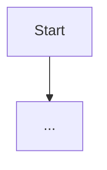

<!--
DESIGN.md — running design document for this project.
Filled out during an /architect session. Human- and agent-readable.
Keep entries short: what was decided, and a line on why.
-->

# <Project> — Design

## Overview
<!-- One paragraph: what this project is and the intent behind it. -->

## Flow Diagram
<!-- A HIGH-LEVEL Mermaid flowchart, for the user to interpret at a glance.
     Show the major moving parts and how data/control flows between them — NOT
     every module or edge case (that fidelity is /to-spec's job, which builds on
     this diagram). Label nodes/edges in the Glossary's vocabulary, in plain terms
     a human recognizes. Keep it readable on one screen. -->

## Glossary
<!-- Agreed terms. Frozen once set; change only when explicitly changed. -->
| Term | Meaning |
|------|---------|
|      |         |

## Decisions
<!-- What was settled, newest first. One line of reasoning each. Only add once the user approves. -->
- **<decision>** — <why>

## Open Questions
<!-- Unanswered or needs-research items, so a future session can resume here. -->
- [ ] <question> — <context / what's blocking an answer>
