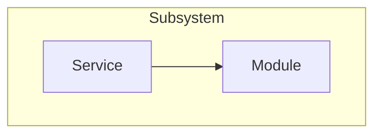

<!--
SPEC.md — specification for this project/feature.
Synthesized from DESIGN.md during a /to-spec session. Do NOT re-interview here.
This is the input for creating TRACKER.md issues (via /task-tracker) — write it
precisely enough that its parts decompose cleanly into tasks.
Fill out every section below. Delete these comments once real content exists.
-->

# <Project> — Specification

## Problem Statement
<!-- The problem, from the user's perspective. Draw from DESIGN.md's Overview /
     intent. State the pain, not the solution. -->

## Solution
<!-- The solution, from the user's perspective. Draw from DESIGN.md's Decisions.
     What the user gets — not how it is wired internally. -->

## Glossary
<!-- Carried verbatim from DESIGN.md so this spec and its issues share one
     vocabulary. Frozen; change only when the design changes. -->
| Term | Meaning |
|------|---------|
|      |         |

## User Stories
<!-- A LONG, numbered list. Format: As an <actor>, I want a <feature>, so that
     <benefit>. Cover every aspect of the feature — be exhaustive.
     e.g. 1. As a mobile bank customer, I want to see the balance on my accounts,
             so that I can make better informed decisions about my spending. -->
1.

## Implementation Decisions
<!-- What will be built/modified: the modules and their interfaces, architectural
     decisions, schema changes, API contracts, specific interactions. Cite
     relevant ADRs by number (e.g. "see ADR 003") rather than restating them.
     No file paths or code snippets — they go stale.
     Exception: a prototype snippet that encodes a decision more precisely than
     prose can (schema, state machine, type shape) may be inlined here, trimmed
     to the decision-rich part and noted as coming from a prototype. -->
-

## Flow Diagram
<!-- A DETAILED, high-fidelity Mermaid flowchart that builds on DESIGN.md's
     high-level one: same overall shape and vocabulary, decomposed down to the
     concrete services/modules and the interfaces/data flowing between them. Use
     subgraphs to group a design-level box's internals so the correspondence
     stays visible. Every node/edge must trace to a Decision, ADR, or code you
     explored — no invented flow. Keep it human-readable; if it grows too dense,
     split into one diagram per subsystem. Keep labels in the Glossary's terms;
     no volatile file paths. -->

## Testing Decisions
<!-- - What makes a good test here: exercise external behavior, not implementation
       details.
     - The seams settled on at the checkpoint (prefer existing, highest possible,
       fewest — ideally one).
     - Which modules are tested.
     - Where the tests live: with the project (see AGENTS.md) — for Rust, unit
       tests in-file and integration tests in the crate's own tests/ dir; the
       repo-level tests/ tree is only for cross-apps/ end-to-end tests.
     - Prior art: similar existing tests to model these on. -->
-

## Out of Scope
<!-- What is explicitly excluded — including any DESIGN.md Open Questions being
     deferred rather than answered. -->
-

## Further Notes
<!-- Anything else worth recording. -->
-
